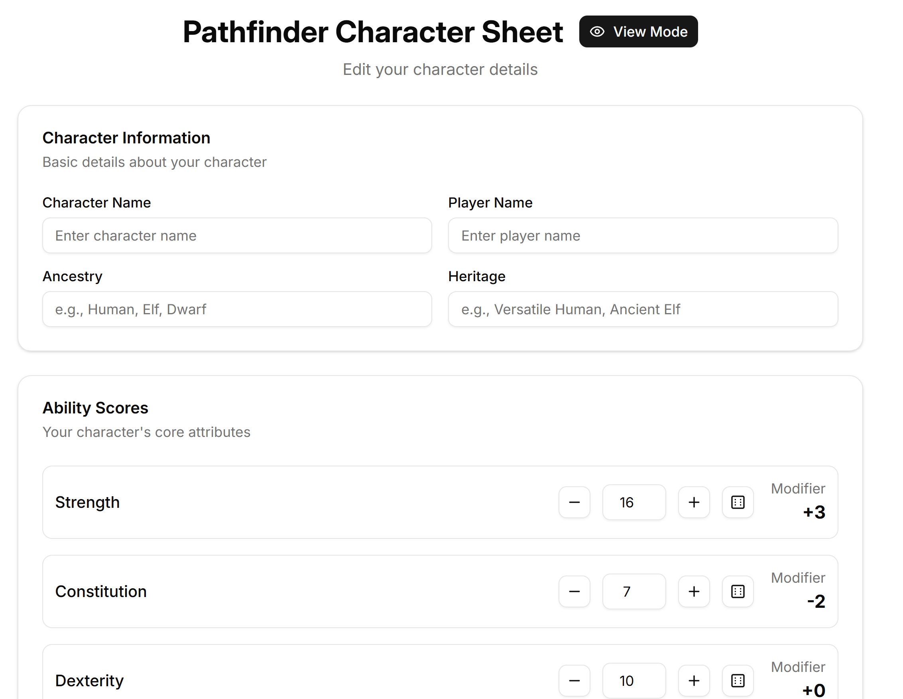

# Pathfinder Sheet 🧙‍♂️

**Pathfinder Sheet** is a lightweight character sheet builder for [Pathfinder](https://paizo.com/pathfinder), built as a Progressive Web App (PWA).  
It’s a personal project designed to help players quickly create, edit, and manage their Pathfinder characters on any device — even without internet access.

## ✨ Features

- 🧠 Attribute editing (Strength, Dexterity, Intelligence, etc.)
- 💾 Local persistence (no accounts, no cloud — your data stays on your device)
- 🌓 Dark mode support
- ⚙️ Editable / read-only views
- 🧩 Modular UI built with **React**, **React Router**, **Tailwind CSS**, and **shadcn/ui**

## 🧠 Core Logic Overview

The `core/` directory contains the pure TypeScript logic that powers the Pathfinder Sheet application.  
It is fully decoupled from the frontend and focuses on:

- Modeling character data (attributes, skills, feats, etc.)
- Handling transformations when attributes change
- Maintaining consistency through a registry-based system

Inspired by **Atomic Design**, the architecture separates simple data structures ("atoms") from more complex, composite behaviors inside the `core/models/` directory.

All logic for managing dynamic relationships (e.g. increasing Strength affects skills and feat prerequisites) is centralized in registries, such as `FeatRegistry`, built via a `RegistryFactory`.

This clean separation ensures reusability, testability, and scalability across platforms.

---

Built with ❤️ using React Router.
